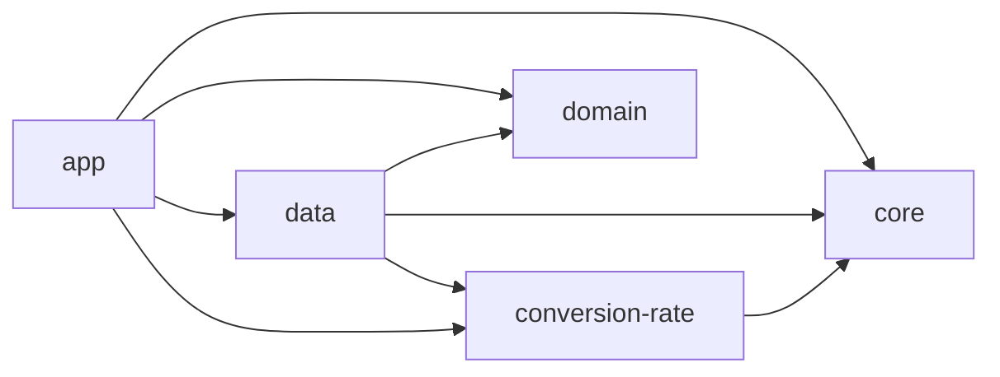

# Personal Finance Tracker

A modern Android personal finance application built with **Clean/Hexagonal Architecture**, **Jetpack Compose**, and an **Offline-First** data strategy. Track transactions, manage budgets, and convert currencies — all with seamless background synchronization.

## Demo

<video src="./docs/demo/video_26_04_12_15_19_19.mp4" controls width="100%"></video>


## Tech Stack

| Category | Technology |
|---|---|
| **Language** | Kotlin |
| **UI** | Jetpack Compose + Material 3 |
| **Architecture** | Clean / Hexagonal (Ports & Adapters) |
| **Presentation** | MVI (Model-View-Intent) via custom `BaseViewModel` |
| **Local DB** | Room |
| **Remote** | Firebase Firestore, Ktor HTTP Client |
| **DI** | Koin (multi-module) |
| **Async** | Coroutines + Flow |
| **Background Sync** | WorkManager |
| **Navigation** | Jetpack Compose Navigation (modular Feature injection) |
| **Testing** | JUnit, Turbine, Fakes (no mocking frameworks) |

## Module Structure

```
PersonalFinanceTracker/
├── :app              → Presentation layer (Compose UI, ViewModels, Feature navigation)
├── :domain           → Core business logic (Entities, UseCases, Repository interfaces)
├── :data             → Data layer (Room, Firebase, Ktor, Sync workers, Mappers)
├── :core             → Shared kernel (UiText, Navigation contracts, DI, Models)
└── :conversion-rate  → Self-contained hexagonal module (own Domain + Data + Sync)
```

**Module Dependency Graph:**



## Getting Started

### Prerequisites

- Android Studio Ladybug or later
- JDK 11+
- A Firebase project with Firestore enabled

### Build & Run

1. Clone the repository
2. Open in Android Studio
3. Place your `google-services.json` in the `app/` directory
4. Build and run on an emulator or device (min SDK 24)

## Documentation

Detailed documentation is organized by topic in the `docs/` directory:

### Architecture
- [Hexagonal Architecture](docs/architecture/01_hexagonal_architecture.md) — Ports & Adapters, module boundaries, dependency rule
- [Offline-First](docs/architecture/02_offline_first.md) — Single Source of Truth, sync lifecycle, conflict resolution
- [Presentation (MVI)](docs/architecture/03_presentation_mvi.md) — BaseViewModel, State, Events, SideEffects, UiText
- [Navigation](docs/architecture/04_navigation.md) — Modular Feature-based graph injection via Koin
- [Dependency Injection](docs/architecture/05_dependency_injection.md) — Koin multi-module wiring strategy

### Data Layer
- [Data Layer Overview](docs/data/data_layer.md) — Three mapping layers, DAOs, remote sources
- [Sync & Conflict Resolution](docs/data/sync_and_conflict.md) — Dual sync systems, Last-Write-Wins

### Modules
- [Conversion-Rate Module](docs/modules/conversion_rate_module.md) — Hexagonal case study with own DB, Ports, Adapters

### Core
- [Shared Utilities](docs/core/shared_utilities.md) — UiText, CoroutineDispatchers, DefaultCurrencies

### Testing
- [Testing Strategy](docs/testing/testing_strategy.md) — Fakes, Turbine, MainDispatcherRule, naming conventions
