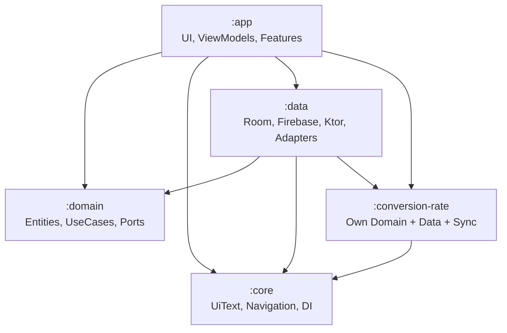
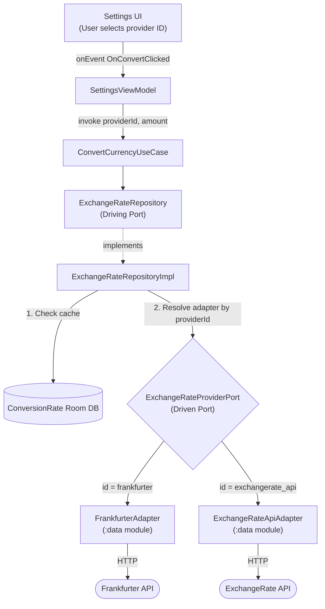

# Hexagonal Architecture (Ports & Adapters)

This project follows the **Hexagonal Architecture** pattern (also known as Ports & Adapters), ensuring that the core business logic remains completely isolated from infrastructure concerns like databases, APIs, and UI frameworks.

## Core Concept

The architecture is built around a simple rule:

> **Dependencies always point inward.** The domain never depends on outer layers — outer layers depend on the domain.

The domain defines **ports** (interfaces), and outer layers provide **adapters** (implementations). This means you can swap a database, an API provider, or even the entire UI framework without touching a single line of business logic.

## Module Responsibilities

### `:domain` — The Core

The innermost layer. Contains **zero** Android or framework dependencies.

- **Entities:** `Transaction`, `Budget`, `Type` — pure Kotlin data classes representing business concepts.
- **Repository Interfaces (Ports):** `TransactionRepository`, `BudgetRepository`, `UserPreferencesRepository` — contracts that the data layer must fulfill.
- **UseCases:** Single-responsibility classes that orchestrate business operations (e.g., `AddTransactionUseCase`, `GetBudgetsUseCase`).

### `:data` — Driven Adapters

Implements the ports defined by `:domain` and `:conversion-rate`.

- **Room DAOs:** Local persistence for transactions and budgets.
- **Firebase Firestore:** Remote storage via `RemoteTransactionRepo`, `RemoteBudgetRepo`.
- **Ktor HTTP Clients:** `FrankfurterApiService`, `ExchangeRateApiService` for currency exchange rates.
- **Mappers:** Three-layer mapping pipeline (Entity ↔ Domain ↔ DTO).
- **Sync Workers:** `DataSyncWorker` + `DataSyncScheduler` for background synchronization.
- **Exchange Rate Adapters:** `FrankfurterAdapter`, `ExchangeRateApiAdapter` — concrete implementations of the `ExchangeRateProviderPort` driven port.

### `:app` — Driving Adapters

The outermost layer that drives the application.

- **Compose UI:** Screens that render state and emit user events.
- **ViewModels:** MVI-based state machines that call UseCases and manage UI state.
- **Feature Navigation:** `HomeFeatureImpl`, `TransactionFeatureImpl`, etc. — register routes into the NavHost.

### `:conversion-rate` — Self-Contained Hexagonal Module

A standalone module that demonstrates hexagonal architecture within itself:

- **Own domain:** `ExchangeRateRepository` (port), `ExchangeRateProviderPort` (driven port), UseCases.
- **Own data:** `ConversionRateDatabase` (separate Room DB), `ExchangeRateRepositoryImpl`.
- **Own sync:** `RateSyncManager`, `RateSyncScheduler`, `RateSyncWorker`.

See [Conversion-Rate Module](../modules/conversion_rate_module.md) for a detailed case study.

### `:core` — Shared Kernel

Cross-cutting concerns that all modules depend on.

- `UiText` — ViewModel-friendly text abstraction.
- `CoroutineDispatchers` — Injectable dispatcher wrapper for testability.
- `Feature`, `AppRoutes` — Navigation contracts.
- `DefaultCurrencies`, `DefaultCategories` — Static reference data.

## The Dependency Rule



Notice that `:domain` has **no outgoing dependencies** to implementation modules. It only depends on pure Kotlin — making it fully testable and portable.

## Hexagonal Use-Case Flow — Currency Conversion

This is the best example of Ports & Adapters in action. The `conversion-rate` module defines a **driven port** (`ExchangeRateProviderPort`). The `:data` module provides concrete **adapters** (Frankfurter API, ExchangeRate API). The user selects a provider by ID in Settings — the domain resolves the correct adapter at runtime without knowing which API it calls.



> **Key takeaway:** The domain **never knows** which HTTP API is called. Swapping or adding a new provider = adding a new adapter class + a Koin binding with a named qualifier. Zero changes to domain code.

## How to Add a New Adapter

For example, to add a new exchange rate provider:

1. Create `NewProviderApiService.kt` in `:data` — handles raw HTTP calls.
2. Create `NewProviderAdapter.kt` in `:data` — implements `ExchangeRateProviderPort` with a unique `id`.
3. Register in `dataModule`:
   ```kotlin
   single<ExchangeRateProviderPort>(named(NewProviderAdapter.PROVIDER_ID)) {
       NewProviderAdapter(get())
   }
   ```
4. Done. The `ExchangeRateRepositoryImpl` automatically receives it via `getAll()`.
