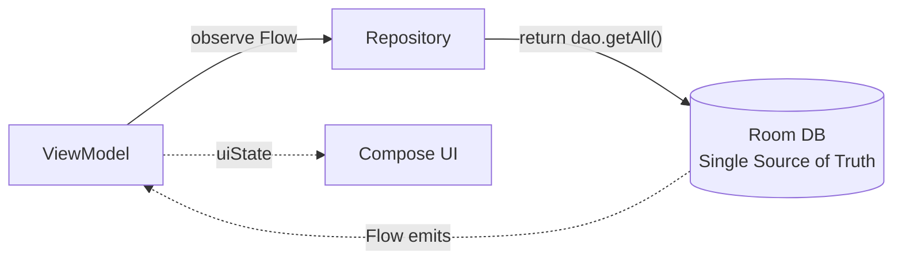
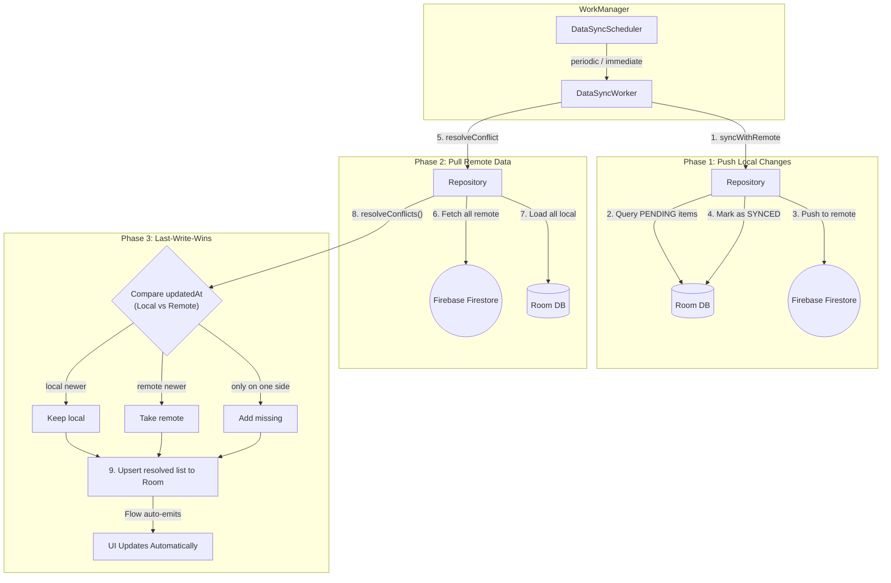
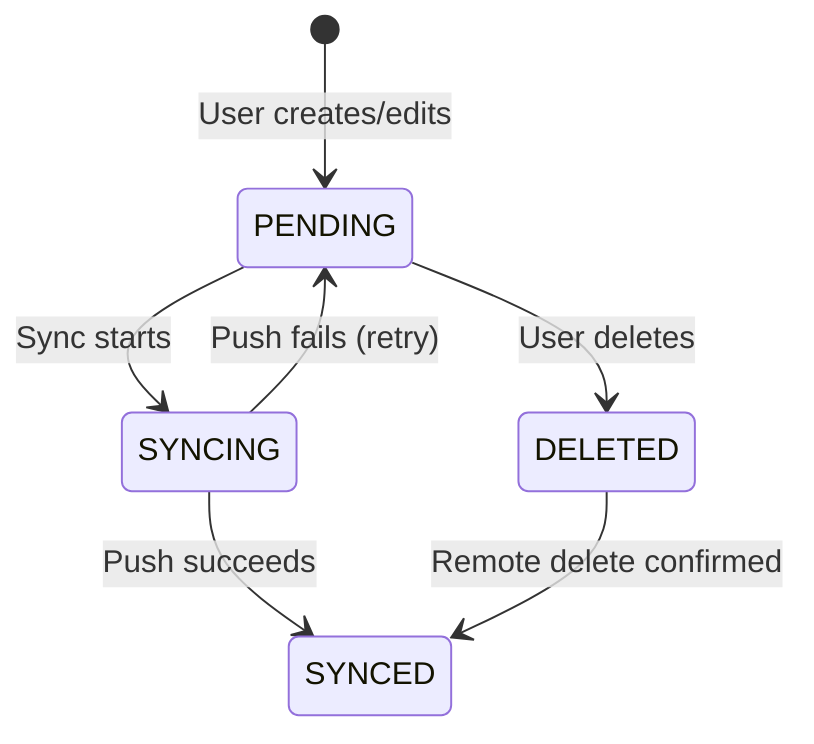

# Offline-First Architecture

This application follows an **Offline-First** data strategy where the local Room database is the **Single Source of Truth (SSOT)** for all UI data. The network is never read directly by the UI — it is only used for background synchronization.

## Core Principle

> **The UI always reads from Room. The network only writes to Room.**

This guarantees:
- **Zero-latency reads** — the UI never waits for a network response to display data.
- **Full offline functionality** — users can create, edit, and delete data without an internet connection.
- **Resilience** — spotty connectivity never causes blank screens or loading spinners for cached data.

## Read Path

The UI layer (ViewModels) observes Room `Flow`s via the Repository. Data is emitted reactively — any change to the database automatically updates the UI.



The ViewModel **never** calls a network API directly. It always reads from the Repository, which always reads from Room.

## Write Path

When a user creates, edits, or deletes a transaction or budget:

1. The Repository **immediately writes to Room** with a `syncStatus = PENDING`.
2. The UI updates **instantly** (via Flow emission).
3. The `DataSyncScheduler` triggers a background sync **when connectivity is available**.

This means the user gets immediate feedback, and synchronization happens silently in the background.

## Sync Lifecycle

Background synchronization is handled by `DataSyncWorker` (a `CoroutineWorker` managed by WorkManager). A single worker handles both Transactions and Budgets sequentially.



### Phase 1: Push Local Changes (`syncWithRemote()`)

The Repository queries all entities with `syncStatus = PENDING`, pushes them to Firebase Firestore, and marks them as `SYNCED` locally.

### Phase 2: Pull Remote Data (`resolveConflict()`)

The Repository fetches all entities from Firebase and loads all local entities from Room, preparing both lists for conflict resolution.

### Phase 3: Conflict Resolution (`resolveConflicts()`)

A generic higher-order function compares local and remote entities by ID and applies **Last-Write-Wins** based on the `updatedAt` timestamp:

```kotlin
fun <E, R> resolveConflicts(
    localData: List<E>,
    remoteData: List<R>,
    remoteMapper: (R) -> E,
    idMapper: (E) -> String,
    idMapperRemote: (R) -> String,
    timeMapper: (E) -> Long,
    timeMapperRemote: (R) -> Long
): List<E>
```

**Resolution rules:**
- **Local only** → Keep the local entity.
- **Remote only** → Map and add the remote entity.
- **Both exist** → Compare `updatedAt` — the newer one wins.

The resolved list is upserted back into Room, and because the UI observes Room via Flow, it **automatically receives the updated data**.

## Entity Sync Status Lifecycle

Each `TransactionEntity` and `BudgetEntity` carries a `syncStatus` field tracked via `SyncStatusEnum`:



| Status | Meaning |
|---|---|
| `PENDING` | Created or modified locally, not yet synced |
| `SYNCING` | Currently being pushed to remote |
| `SYNCED` | Successfully synchronized with remote |
| `DELETED` | Soft-deleted locally, pending remote deletion |

## WorkManager Configuration

The `DataSyncScheduler` wraps WorkManager with two scheduling modes:

- **Periodic:** Every 15 minutes via `PeriodicWorkRequestBuilder`. Uses `ExistingPeriodicWorkPolicy.KEEP` to avoid duplicate schedules.
- **Immediate:** One-time sync via `OneTimeWorkRequestBuilder`. Uses `ExistingWorkPolicy.REPLACE` to cancel any in-flight immediate work.

Both require a `NetworkType.CONNECTED` constraint and use `BackoffPolicy.EXPONENTIAL` (starting at 30 seconds) for retries. The worker has a maximum of 3 retry attempts before reporting failure.
