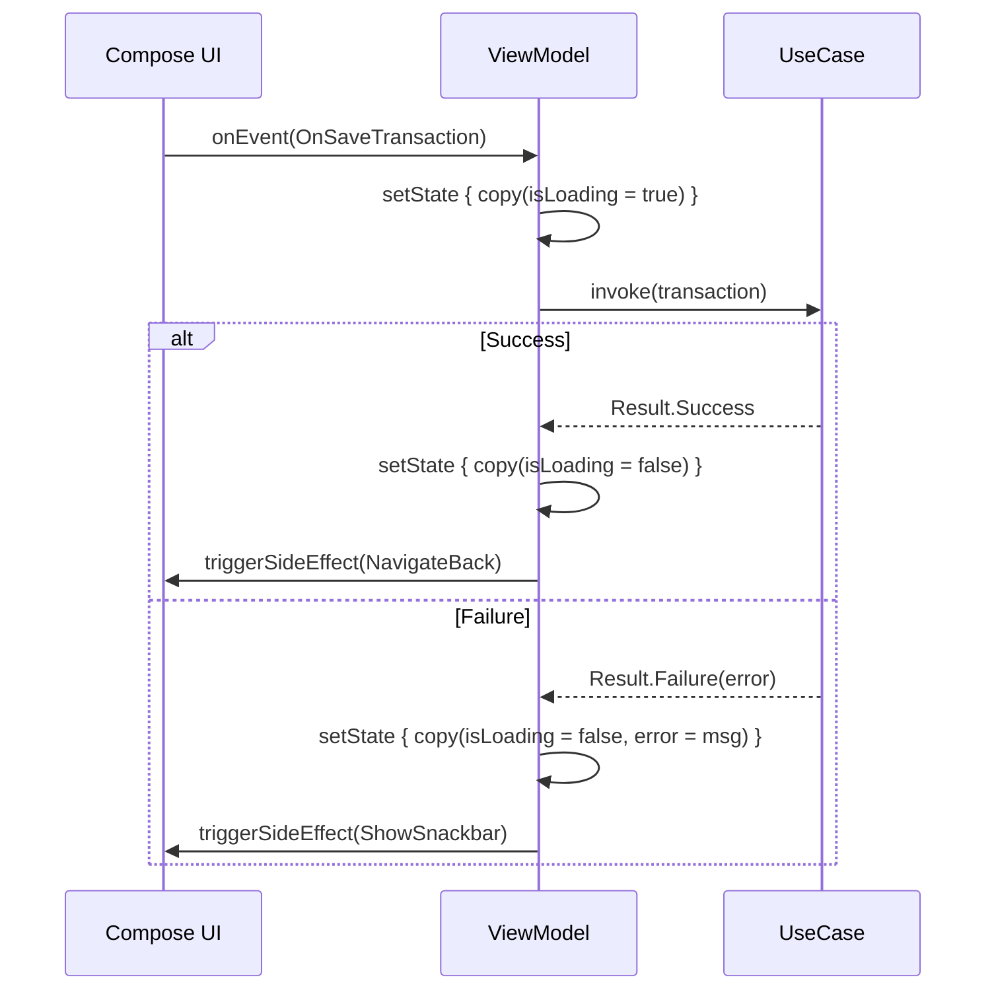

# Presentation Layer — MVI (Model-View-Intent)

The presentation layer follows the **MVI** (Model-View-Intent) pattern, providing a strict unidirectional data flow that makes the UI predictable, testable, and easy to debug.

## Core Components

The MVI infrastructure is defined in `:core` and consists of three building blocks:

### Marker Interfaces (`MVIContract.kt`)

```kotlin
interface MVIState         // Each screen defines its own State data class
interface MVIUiEvent       // Each screen defines its own sealed class of events
interface MVIUiSideEffect  // Each screen defines its own sealed class of side effects
```

### `BaseViewModel<S, E, SE>` (`BaseViewModel.kt`)

An abstract `ViewModel` that every feature ViewModel extends. It provides:

| Component | Type | Purpose |
|---|---|---|
| `_uiState` | `MutableStateFlow<S>` | Holds the current screen state |
| `uiState` | `StateFlow<S>` | Read-only state exposed to the UI |
| `_sideEffect` | `Channel<SE>(CONFLATED)` | One-shot events (navigation, snackbars) |
| `sideEffect` | `Flow<SE>` | Exposed to the UI via `receiveAsFlow()` |

**Key methods:**

```kotlin
// UI calls this to send events
fun onEvent(event: E) { handleEvent(event) }

// Subclass implements this to process events
protected abstract fun handleEvent(event: E)

// Update state immutably
protected fun setState(reducer: S.() -> S) {
    _uiState.value = uiState.value.reducer()
}

// Emit a one-shot side effect
protected fun triggerSideEffect(effect: SE) {
    viewModelScope.launch { _sideEffect.send(effect) }
}
```

## Unidirectional Data Flow



### Flow Summary

1. **User Action** → Compose UI calls `viewModel.onEvent(SomeEvent)`.
2. **Event Processing** → ViewModel's `handleEvent()` processes the event, calls UseCases.
3. **State Update** → ViewModel calls `setState { copy(...) }` to produce a new immutable state.
4. **UI Recompose** → Compose automatically recomposes when `uiState` changes.
5. **Side Effects** → One-shot events (navigation, toasts) are sent via `triggerSideEffect()`.

## State vs Side Effects

**State (`StateFlow`)** is for persistent UI data:
- Loading indicators
- Form field values
- List data
- Error messages displayed on screen

**Side Effects (`Channel`)** are for one-shot events that should happen **exactly once**:
- Navigate to another screen
- Show a Snackbar
- Close a dialog

Using a `Channel(CONFLATED)` ensures side effects are not replayed on configuration changes (e.g., screen rotation), unlike `SharedFlow` with replay.

## Contract Pattern

Each screen defines its own contract — a file containing the specific `State`, `Event`, and `SideEffect` types. For example, `AddTransactionContract.kt`:

```kotlin
// State
data class AddTransactionState(
    val amount: String = "",
    val category: String = "",
    val isLoading: Boolean = false,
    val error: UiText? = null
) : MVIState

// Events
sealed class AddTransactionEvent : MVIUiEvent {
    data class OnAmountChanged(val amount: String) : AddTransactionEvent()
    data class OnCategoryChanged(val category: String) : AddTransactionEvent()
    data object OnSaveClicked : AddTransactionEvent()
}

// Side Effects
sealed class AddTransactionSideEffect : MVIUiSideEffect {
    data object NavigateBack : AddTransactionSideEffect()
    data class ShowError(val message: UiText) : AddTransactionSideEffect()
}
```

## `UiText` — Framework-Free Text

ViewModels often need to produce user-facing text (error messages, labels), but they should **not** depend on Android `Context`. The `UiText` sealed class solves this:

```kotlin
sealed class UiText {
    data class DynamicString(val value: String) : UiText()
    class StringResource(@StringRes val resId: Int, vararg val args: Any) : UiText()

    @Composable
    fun asString(): String = when (this) { ... }

    fun asString(context: Context): String = when (this) { ... }
}
```

**Usage in ViewModel:**
```kotlin
triggerSideEffect(ShowError(UiText.StringResource(R.string.error_invalid_amount)))
```

**Usage in Composable:**
```kotlin
Text(text = sideEffect.message.asString())
```

## Collecting in Compose

```kotlin
@Composable
fun AddTransactionScreen(viewModel: AddTransactionViewModel = koinViewModel()) {
    val state by viewModel.uiState.collectAsStateWithLifecycle()

    LaunchedEffect(Unit) {
        viewModel.sideEffect.collect { effect ->
            when (effect) {
                is NavigateBack -> navController.popBackStack()
                is ShowError -> snackbarHostState.showSnackbar(effect.message.asString(context))
            }
        }
    }

    // Render UI based on `state`
}
```
