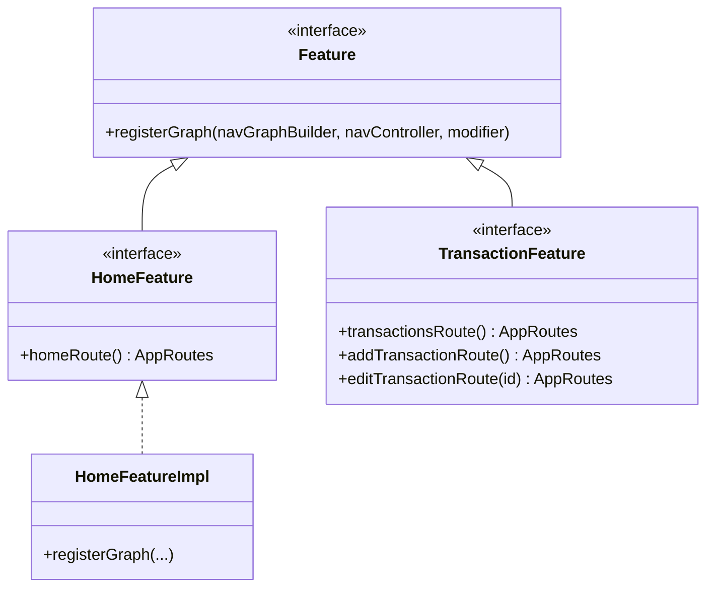
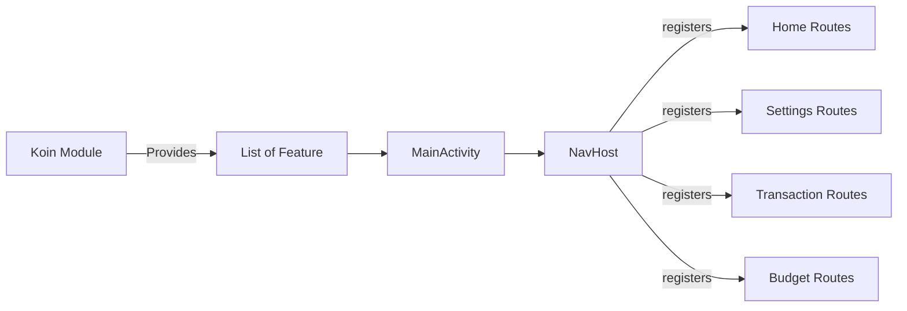

# Navigation — Modular Feature-Based Graph Injection

This project uses a **decentralized "Plugin" routing architecture** where each feature module registers its own navigation graph into the central `NavHost` — without the `app` module needing to know the internal routes of any feature.

## The Problem with Traditional Navigation

In most Android apps, `MainActivity` (or the main NavHost) imports every screen route directly:

```kotlin
// ❌ Traditional approach — tightly coupled
NavHost(...) {
    composable("home") { HomeScreen() }
    composable("add_transaction") { AddTransactionScreen() }
    composable("settings") { SettingsScreen() }
    composable("budget") { BudgetScreen() }
    // Every new screen = change this file
}
```

This violates the Open/Closed Principle and creates a maintenance bottleneck.

## Our Solution — Feature Interface + Koin

### 1. Core Contract (`Feature` interface)

Defined in `:core`, this interface is the only navigation contract the `app` module knows about:

```kotlin
interface Feature {
    fun registerGraph(
        navGraphBuilder: NavGraphBuilder,
        navController: NavController,
        modifier: Modifier = Modifier
    )
}

// Extension for clean registration syntax
fun NavGraphBuilder.register(
    feature: Feature,
    navController: NavController,
    modifier: Modifier = Modifier
) {
    feature.registerGraph(this, navController, modifier)
}

interface AppRoutes  // Marker for type-safe route objects
```

### 2. Feature-Specific Contracts

Each feature extends `Feature` with its own route accessors, enabling cross-feature navigation without direct coupling:

```kotlin
interface HomeFeature : Feature {
    fun homeRoute(): AppRoutes
}

interface TransactionFeature : Feature {
    fun transactionsRoute(): AppRoutes
    fun addTransactionRoute(): AppRoutes
    fun editTransactionRoute(transactionId: String): AppRoutes
}

interface SettingsFeature : Feature {
    fun settingsRoute(): AppRoutes
}

interface BudgetFeature : Feature {
    fun budgetRoute(): AppRoutes
    fun addBudgetRoute(): AppRoutes
}
```

### 3. Feature Implementation

Each feature provides its own implementation that registers its Compose screens:

```kotlin
class HomeFeatureImpl(
    private val transactionsFeature: TransactionFeature,
    private val settingsFeature: SettingsFeature
) : HomeFeature {

    override fun homeRoute(): AppRoutes = HomeRoutes.HomeRoute

    override fun registerGraph(
        navGraphBuilder: NavGraphBuilder,
        navController: NavController,
        modifier: Modifier
    ) {
        navGraphBuilder.homeRoute(
            modifier = modifier,
            onNavigateToAddTransaction = {
                navController.navigate(transactionsFeature.addTransactionRoute())
            },
            onNavigateToSettings = {
                navController.navigate(settingsFeature.settingsRoute())
            }
        )
    }
}
```

> Notice how `HomeFeatureImpl` navigates to transactions by calling `transactionsFeature.addTransactionRoute()` — it never directly references `AddTransactionRoute`. This is the key to decoupling.

### 4. Dynamic Registration in `MainActivity`

```kotlin
@Composable
fun AppNavGraph(
    navController: NavHostController,
    modifier: Modifier = Modifier,
    features: List<Feature> = emptyList()
) {
    NavHost(
        navController = navController,
        startDestination = HomeRoutes.HomeRoute,
        // ... transition animations ...
    ) {
        // ✅ Dynamic — each feature registers itself
        features.forEach {
            register(it, navController, modifier)
        }
    }
}
```

The `List<Feature>` is provided by Koin via `getAll<Feature>()`:

```kotlin
val allFeatures: List<Feature> = getKoin().getAll<Feature>()
```

## Class Diagram



## Registration Flow



## Adding a New Feature

1. Create a `NewFeature` interface in `:core/navigation/features/`.
2. Create `NewFeatureImpl` in `:app/features/new/navigation/`.
3. Add a Koin binding in `appModule`:
   ```kotlin
   singleOf(::NewFeatureImpl) { bind<NewFeature>() }
   ```
4. Done. `getAll<Feature>()` automatically picks it up — **zero changes to `MainActivity`**.

## Transition Animations

The `NavHost` defines shared transition animations for all routes:

| Transition | Animation |
|---|---|
| **Enter** | `slideIntoContainer(Left)` + `fadeIn` (400ms) |
| **Exit** | `scaleOut(0.98f)` + `fadeOut` (500ms) |
| **Pop Enter** | `scaleIn(0.98f)` + `fadeIn` (400ms) |
| **Pop Exit** | `slideOutOfContainer(Right)` + `fadeOut` (500ms) |
