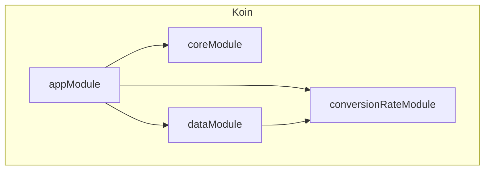

# Dependency Injection — Koin Multi-Module

This project uses **Koin** as a lightweight, Kotlin-first dependency injection framework. Dependencies are organized into **four Koin modules**, each corresponding to an architecture layer.

## Module Overview



## Module Breakdown

### `coreModule`

Provides cross-cutting infrastructure:

```kotlin
val coreModule = module {
    single<Clock> { Clock.System }
    single {
        CoroutineDispatchers(
            main = Dispatchers.Main,
            io = Dispatchers.IO,
            default = Dispatchers.Default
        )
    }
}
```

- **`Clock`** — Injectable clock for testability (swap with a fake in tests).
- **`CoroutineDispatchers`** — Injectable dispatcher wrapper (swap with `StandardTestDispatcher` in tests).

### `dataModule`

The largest module — provides network clients, databases, repositories, and sync infrastructure:

```kotlin
val dataModule = module {
    // Network
    single { HttpClient(OkHttp) { /* Ktor config */ } }

    // Database
    single<FirebaseFirestore> { Firebase.firestore }
    single<TrackerDatabase> { Room.databaseBuilder(...).build() }
    factory { get<TrackerDatabase>().transactionDao() }
    factory { get<TrackerDatabase>().budgetDao() }

    // Repositories (Port → Adapter binding)
    singleOf(::TransactionRepositoryImp) { bind<TransactionRepository>() }
    singleOf(::BudgetRepositoryImp) { bind<BudgetRepository>() }
    singleOf(::UserPreferencesRepositoryImpl) { bind<UserPreferencesRepository>() }
    singleOf(::RemoteTransactionRepoImpl) { bind<RemoteTransactionRepo>() }
    singleOf(::RemoteBudgetRepoImpl) { bind<RemoteBudgetRepo>() }

    // Exchange Rate Adapters (named qualifiers)
    single<ExchangeRateProviderPort>(named(FrankfurterAdapter.PROVIDER_ID)) {
        FrankfurterAdapter(get())
    }
    single<ExchangeRateProviderPort>(named(ExchangeRateApiAdapter.PROVIDER_ID)) {
        ExchangeRateApiAdapter(get())
    }

    // Sync
    single { WorkManager.getInstance(androidContext()) }
    workerOf(::DataSyncWorker)
    singleOf(::DataSyncScheduler) { bind<DataSyncManager>() }
}
```

### `conversionRateModule`

Self-contained module for the currency conversion feature:

```kotlin
val conversionRateModule = module {
    // Own Room DB
    single<ConversionRateDatabase> { Room.databaseBuilder(...).build() }
    single { get<ConversionRateDatabase>().conversionRateDao() }

    // Repository — injects ALL ExchangeRateProviderPort adapters via getAll()
    single<ExchangeRateRepository> {
        ExchangeRateRepositoryImpl(
            providers = getAll(),  // ← Collects all named providers
            dao = get(),
            syncManager = get()
        )
    }

    // Use Cases
    factoryOf(::ConvertCurrencyUseCase)
    factoryOf(::GetProvidersUseCase)
    factoryOf(::SyncExchangeRatesUseCase)
    factoryOf(::InitializeRateSyncUseCase)
    factoryOf(::ObserveSyncStatusUseCase)

    // Sync
    single { SyncPreferences(androidContext()) }
    single<RateSyncManager> { RateSyncScheduler(WorkManager.getInstance(androidContext()), get()) }
    workerOf(::RateSyncWorker)
}
```

### `appModule`

Provides ViewModels and Feature navigation implementations:

```kotlin
val appModule = module {
    // ViewModels
    viewModelOf(::HomeViewModel)
    viewModelOf(::AddTransactionViewModel)
    viewModelOf(::SettingsViewModel)
    // ...

    // Feature Navigation (injected as List<Feature>)
    singleOf(::HomeFeatureImpl) { bind<HomeFeature>() }
    singleOf(::TransactionFeatureImpl) { bind<TransactionFeature>() }
    singleOf(::SettingsFeatureImpl) { bind<SettingsFeature>() }
    singleOf(::BudgetFeatureImpl) { bind<BudgetFeature>() }
}
```

## Key Koin Patterns Used

### Named Qualifiers

Used when multiple implementations of the same interface exist:

```kotlin
// Registration
single<ExchangeRateProviderPort>(named("frankfurter")) { FrankfurterAdapter(get()) }
single<ExchangeRateProviderPort>(named("exchangerate_api")) { ExchangeRateApiAdapter(get()) }

// Resolution — getAll() collects ALL named instances
single<ExchangeRateRepository> {
    ExchangeRateRepositoryImpl(providers = getAll(), ...)
}
```

### `workerOf()` — WorkManager Integration

Koin provides first-class support for injecting dependencies into `CoroutineWorker`:

```kotlin
workerOf(::DataSyncWorker)    // Automatically injects constructor params
workerOf(::RateSyncWorker)
```

Requires `koin-androidx-workmanager` dependency.

### `singleOf(...) { bind<Interface>() }` — Interface Binding

Binds a concrete class to its interface in one line:

```kotlin
singleOf(::TransactionRepositoryImp) { bind<TransactionRepository>() }
```

### `factory` vs `single`

| Scope | Behavior | Used For |
|---|---|---|
| `single` | One instance for the entire app | Repositories, Databases, HttpClient |
| `factory` | New instance every time | DAOs, UseCases |
| `viewModelOf` | Scoped to the ViewModel lifecycle | ViewModels |
