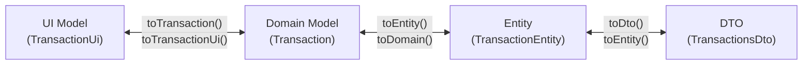

# Data Layer Overview

The data layer (`:data` module) implements the repository interfaces (ports) defined by the `:domain` module. It manages all persistence, network communication, and data transformation.

## Data Sources

### Local — Room Database

The app uses `TrackerDatabase` with two DAOs:
- **`TransactionDao`** — CRUD for transaction entities.
- **`BudgetDao`** — CRUD for budget entities.

The `conversion-rate` module has its own separate `ConversionRateDatabase` for exchange rate caching.

### Remote — Firebase Firestore

Two remote repository interfaces handle Firestore communication:
- **`RemoteTransactionRepo`** / `RemoteTransactionRepoImpl`
- **`RemoteBudgetRepo`** / `RemoteBudgetRepoImpl`

### Remote — Ktor HTTP Clients

For currency exchange rates:
- **`FrankfurterApiService`** — Calls the Frankfurter API.
- **`ExchangeRateApiService`** — Calls the ExchangeRate API.

Each is wrapped by an adapter implementing `ExchangeRateProviderPort`.

## Three-Layer Mapping Pipeline

Data passes through three mapping layers as it moves between the UI, domain, and persistence:



### Layer 1: Domain ↔ Entity

Converts between pure Kotlin domain models and Room entities.

| Domain | Entity |
|---|---|
| `Transaction` | `TransactionEntity` |
| `Budget` | `BudgetEntity` |

Example:
```kotlin
fun Transaction.toTransactionEntity(): TransactionEntity
fun TransactionEntity.toTransaction(): Transaction
```

### Layer 2: Entity ↔ DTO

Converts between Room entities and Firebase Firestore DTOs. Notable field renames may occur here (e.g., `notes` ↔ `description`).

```kotlin
fun TransactionEntity.toTransactionsDto(): TransactionsDto
fun TransactionsDto.toTransactionEntity(): TransactionEntity
```

### Layer 3: Domain ↔ UI Model

Converts between domain models and presentation-layer UI models. UI models add computed properties for rendering.

```kotlin
fun Transaction.toTransactionUi(): TransactionUi
fun TransactionUi.toTransaction(): Transaction
fun List<Transaction>.toTransactionUi(): List<TransactionUi>
```

**UI model computed properties:**
- `TransactionUi`: `formattedDate`, `formattedTime`, `currencySymbol`, `currentCategory`, `isIncome`
- `BudgetUi`: `percentage`, `remaining`, `overBudget`, `isOverBudget`, `isWarning`, `currencySymbol`

### Budget-Specific: `toDisplayData()`

An additional mapping from `BudgetUi` → `BudgetDisplayData` extracts only the fields needed for rendering:

```kotlin
fun BudgetUi.toDisplayData(): BudgetDisplayData
```

## Repository Pattern

Repositories implement domain ports and coordinate between local and remote sources:

```kotlin
// Port (in :domain)
interface TransactionRepository {
    fun getAllTransactions(): Flow<List<Transaction>>
    suspend fun addTransaction(transaction: Transaction): Result<Unit>
    suspend fun syncWithRemote(): Result<Unit>
    suspend fun resolveTransactionsConflict(): Result<Unit>
    // ...
}

// Adapter (in :data)
class TransactionRepositoryImp(
    private val dao: TransactionDao,
    private val remoteRepo: RemoteTransactionRepo
) : TransactionRepository { ... }
```

## Room Migrations

Database migrations are defined in `DataModule.kt`:

```kotlin
private val MIGRATION_11_12 = object : Migration(11, 12) {
    override fun migrate(db: SupportSQLiteDatabase) {
        db.execSQL("ALTER TABLE transactions ADD COLUMN syncStatus TEXT NOT NULL DEFAULT 'PENDING'")
        db.execSQL("ALTER TABLE budgets ADD COLUMN syncStatus TEXT NOT NULL DEFAULT 'PENDING'")
    }
}
```
