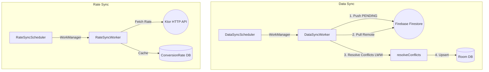
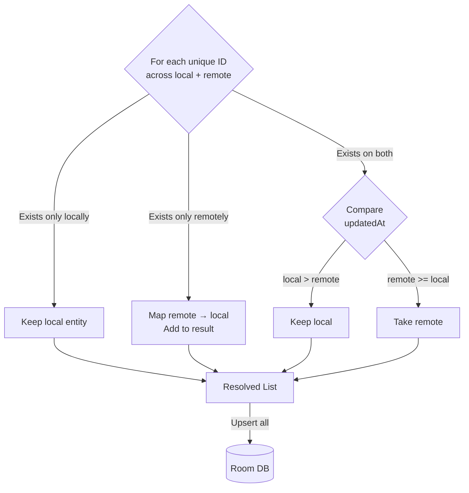
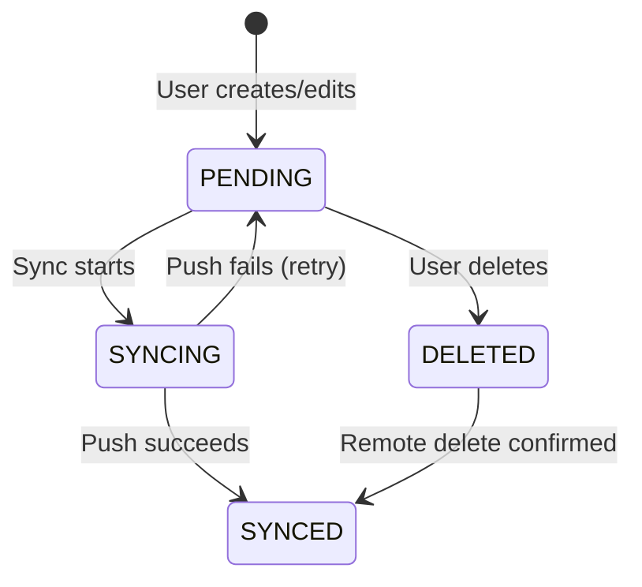

# Sync & Conflict Resolution

The app runs **two independent sync systems** in the background via WorkManager, each with its own scheduler, worker, and data scope.

## Dual Sync Architecture



## 1. Data Sync — Transactions & Budgets

### Components

| Component | Responsibility |
|---|---|
| `DataSyncManager` | Interface defining sync operations |
| `DataSyncScheduler` | WorkManager scheduling (implements `DataSyncManager`) |
| `DataSyncWorker` | `CoroutineWorker` that executes the sync logic |

### Sync Flow

`DataSyncWorker` runs both transaction and budget syncs **sequentially** in a single execution:

```kotlin
override suspend fun doWork(): Result = withContext(Dispatchers.IO) {
    // Phase 1: Push
    transactionRepository.syncWithRemote().getOrThrow()
    budgetRepository.syncWithRemote().getOrThrow()

    // Phase 2 + 3: Pull + Resolve
    transactionRepository.resolveTransactionsConflict().getOrThrow()
    budgetRepository.resolveBudgetsConflict().getOrThrow()

    Result.success()
}
```

### Scheduling Policy

| Mode | Interval | Work Policy | Use Case |
|---|---|---|---|
| **Periodic** | Every 15 minutes | `KEEP` (no-op if already scheduled) | Background keep-alive |
| **Immediate** | One-time | `REPLACE` (cancels any in-flight) | User-triggered refresh |

Both modes require `NetworkType.CONNECTED` and use `BackoffPolicy.EXPONENTIAL` (30s base, max 3 retries).

### Observing Sync Status

`DataSyncScheduler` combines periodic and immediate `WorkInfo` flows into a single `DataSyncStatus`:

```kotlin
sealed class DataSyncStatus {
    data object Idle : DataSyncStatus()
    data object Syncing : DataSyncStatus()
    data object Success : DataSyncStatus()
    data class Failed(val message: String) : DataSyncStatus()
}
```

Immediate work takes precedence when actively running.

## 2. Rate Sync — Exchange Rates

### Components

| Component | Responsibility |
|---|---|
| `RateSyncManager` | Interface for rate sync operations |
| `RateSyncScheduler` | WorkManager scheduling (implements `RateSyncManager`) |
| `RateSyncWorker` | `CoroutineWorker` that fetches and caches rates |
| `SyncPreferences` | Persists sync configuration (provider, interval) |

The rate sync operates independently from data sync. It fetches exchange rates from the selected provider and caches them in the `ConversionRateDatabase`.

## Conflict Resolution — Last-Write-Wins

When local and remote data diverge, the app uses a **generic conflict resolution function** that works for both transactions and budgets:

```kotlin
fun <E, R> resolveConflicts(
    localData: List<E>,
    remoteData: List<R>,
    remoteMapper: (R) -> E,       // Convert remote → local format
    idMapper: (E) -> String,       // Extract ID from local entity
    idMapperRemote: (R) -> String, // Extract ID from remote entity
    timeMapper: (E) -> Long,       // Extract updatedAt from local
    timeMapperRemote: (R) -> Long  // Extract updatedAt from remote
): List<E>
```

### Resolution Rules



| Scenario | Resolution |
|---|---|
| Entity exists only locally | Keep it (new local data not yet synced) |
| Entity exists only remotely | Map and add it (new data from another device) |
| Entity exists on both sides | The one with the newer `updatedAt` wins |

### Why Higher-Order Functions?

The `resolveConflicts()` function is generic over `<E, R>` — it doesn't know about `Transaction` or `Budget` types. Instead, it accepts mapper functions as parameters. This means:

- **Zero code duplication** — the same function handles transactions, budgets, and any future entity type.
- **Type safety** — the compiler ensures the correct mappers are passed.
- **Testability** — the function can be unit-tested with simple test data classes.

## Entity Sync Status

Each entity carries a `syncStatus` field:

```kotlin
enum class SyncStatusEnum {
    PENDING,   // Created/modified locally, not yet synced
    SYNCING,   // Currently being pushed to remote
    SYNCED,    // Successfully synchronized
    DELETED    // Soft-deleted, pending remote deletion
}
```


