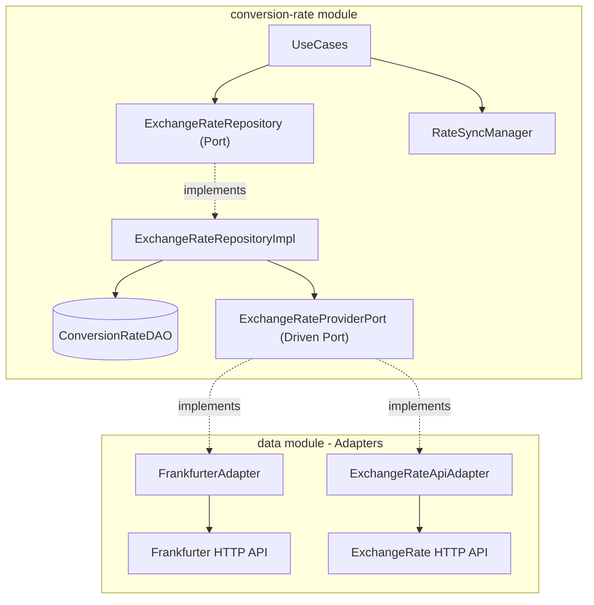

# Conversion-Rate Module — Hexagonal Architecture Case Study

The `:conversion-rate` module is a **self-contained hexagonal architecture module** within the larger app. It has its own domain layer, data layer, sync system, and even its own Room database — making it a perfect case study of the Ports & Adapters pattern.

## Module Structure

```
conversion-rate/
├── domain/
│   ├── port/
│   │   └── ExchangeRateProviderPort.kt     ← Driven port (interface)
│   ├── repository/
│   │   └── ExchangeRateRepository.kt       ← Repository port (interface)
│   └── usecase/
│       ├── ConvertCurrencyUseCase.kt
│       ├── GetProvidersUseCase.kt
│       ├── InitializeRateSyncUseCase.kt
│       ├── ObserveSyncStatusUseCase.kt
│       ├── SchedulePeriodicRateSyncUseCase.kt
│       └── SyncExchangeRatesUseCase.kt
├── data/
│   ├── local/
│   │   ├── ConversionRateDatabase.kt       ← Own Room DB
│   │   └── ConversionRateDao.kt
│   └── repository/
│       └── ExchangeRateRepositoryImpl.kt   ← Adapter (implements port)
├── sync/
│   ├── RateSyncManager.kt                  ← Interface
│   ├── RateSyncScheduler.kt                ← WorkManager wrapper
│   ├── RateSyncWorker.kt                   ← CoroutineWorker
│   ├── SyncPreferences.kt                  ← SharedPrefs for sync config
│   └── SyncStatus.kt
├── di/
│   └── ConversionRateModule.kt             ← Koin module
├── navigation/
│   └── CurrencyConversionNavigator.kt
└── presentation/
    └── CurrencyConverterScreen.kt
```

## The Driven Port — `ExchangeRateProviderPort`

This is the core hexagonal interface. It defines the contract that any exchange rate API must fulfill:

```kotlin
interface ExchangeRateProviderPort {
    val id: String             // e.g., "frankfurter_api"
    val displayName: String    // e.g., "Frankfurter"

    suspend fun getRate(
        fromCurrencyCode: String,
        toCurrencyCode: String
    ): Result<BigDecimal>
}
```

The module **owns** this interface but does **not** provide any implementations. Implementations (adapters) are provided externally by the `:data` module.

## Adapters — Provided by `:data`

The `:data` module provides two concrete adapters:

### `FrankfurterAdapter`
```kotlin
class FrankfurterAdapter(
    private val apiService: FrankfurterApiService
) : ExchangeRateProviderPort {
    override val id = PROVIDER_ID         // "frankfurter_api"
    override val displayName = "Frankfurter"

    override suspend fun getRate(...): Result<BigDecimal> {
        return apiService.getRate(from, to)
    }

    companion object { const val PROVIDER_ID = "frankfurter_api" }
}
```

### `ExchangeRateApiAdapter`
```kotlin
class ExchangeRateApiAdapter(
    private val apiService: ExchangeRateApiService
) : ExchangeRateProviderPort {
    override val id = PROVIDER_ID         // "exchangerate_api"
    override val displayName = "ExchangeRate API"

    override suspend fun getRate(...): Result<BigDecimal> {
        return apiService.getRate(from, to)
    }

    companion object { const val PROVIDER_ID = "exchangerate_api" }
}
```

## Wiring — Koin Named Qualifiers + `getAll()`

The adapters are registered in `dataModule` with **named qualifiers**:

```kotlin
// In dataModule (data module)
single<ExchangeRateProviderPort>(named(FrankfurterAdapter.PROVIDER_ID)) {
    FrankfurterAdapter(get())
}
single<ExchangeRateProviderPort>(named(ExchangeRateApiAdapter.PROVIDER_ID)) {
    ExchangeRateApiAdapter(get())
}
```

The repository in `conversionRateModule` collects **all** of them via `getAll()`:

```kotlin
// In conversionRateModule (conversion-rate module)
single<ExchangeRateRepository> {
    ExchangeRateRepositoryImpl(
        providers = getAll(),  // ← Injects ALL ExchangeRateProviderPort instances
        dao = get(),
        syncManager = get()
    )
}
```

## Architecture Diagram



## Own Sync System

The module has its own sync infrastructure, independent from the data sync:

| Component | Purpose |
|---|---|
| `RateSyncManager` | Interface for sync operations |
| `RateSyncScheduler` | WorkManager wrapper implementing `RateSyncManager` |
| `RateSyncWorker` | `CoroutineWorker` that fetches and caches exchange rates |
| `SyncPreferences` | `SharedPreferences` storing sync config (provider, interval) |
| `SyncStatus` | Observable status (Idle, Syncing, Success, Failed) |

## Navigation

Unlike the main features (which use the `Feature` interface + Koin injection), the conversion-rate module registers its screen **directly** as a `NavGraphBuilder` extension:

```kotlin
// In conversion-rate module
fun NavGraphBuilder.currencyConverterScreen(onNavigateBack: () -> Unit) { ... }

// In MainActivity NavHost
currencyConverterScreen(onNavigateBack = { navController.popBackStack() })
```

## Adding a New Provider

1. Create `NewApiService.kt` in `:data/remote/newprovider/`.
2. Create `NewAdapter.kt` implementing `ExchangeRateProviderPort` with unique `id`.
3. Add to `dataModule`:
   ```kotlin
   single<ExchangeRateProviderPort>(named(NewAdapter.PROVIDER_ID)) { NewAdapter(get()) }
   ```
4. Done — `getAll()` automatically picks it up. Zero changes to conversion-rate module.
